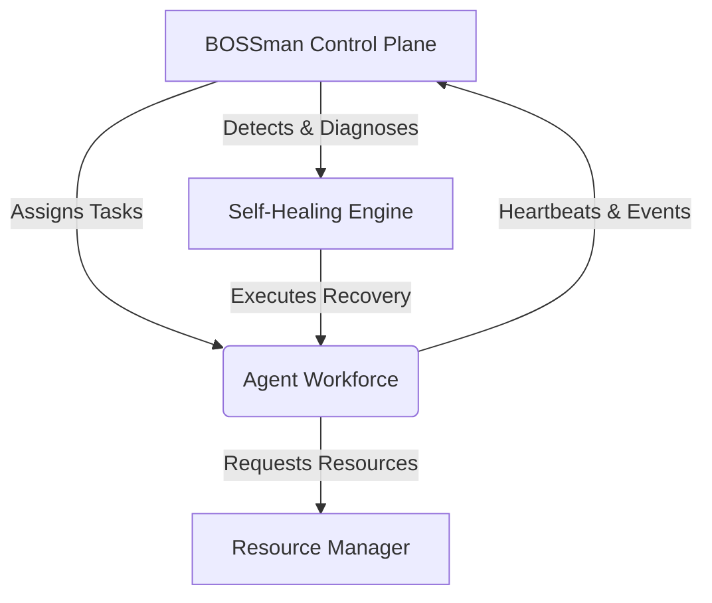
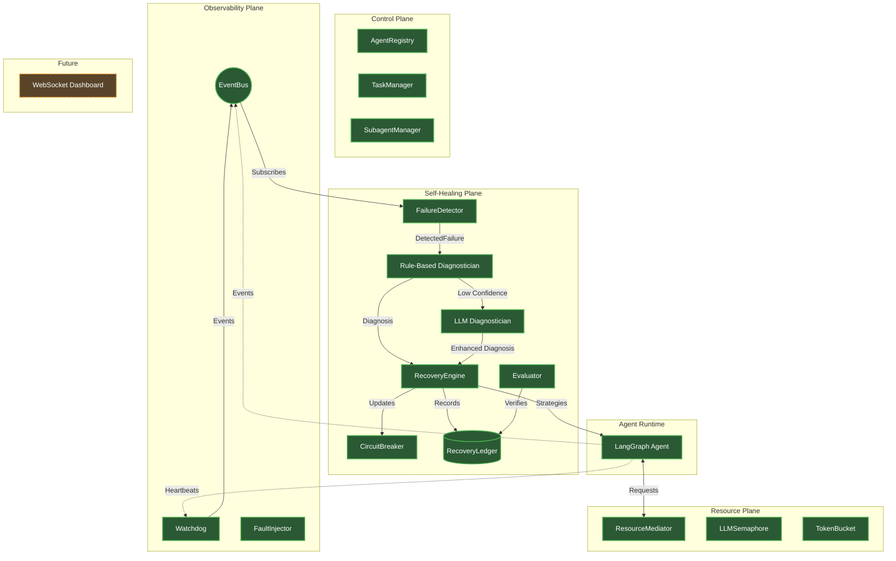
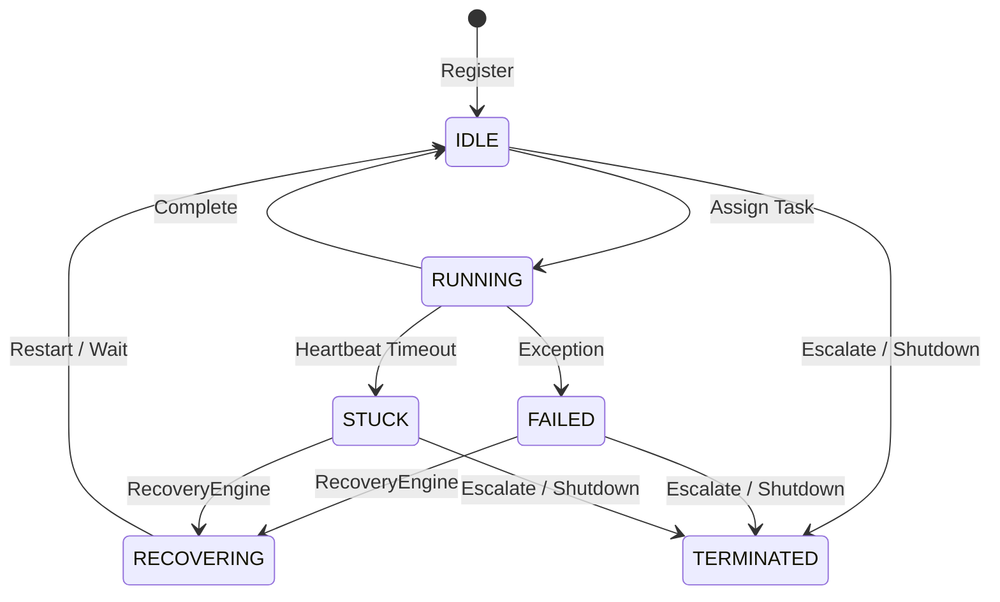
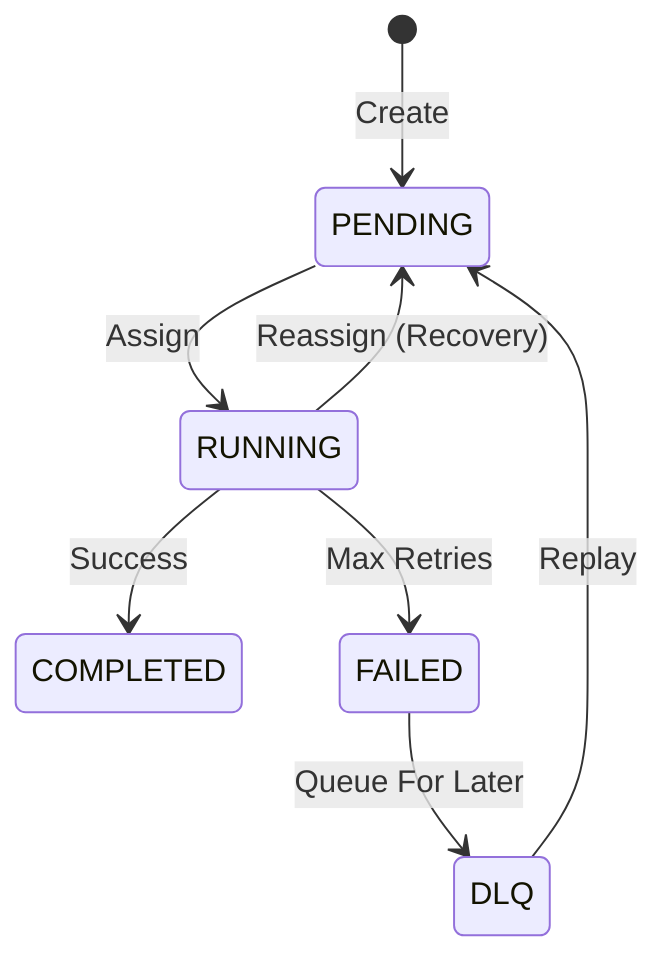
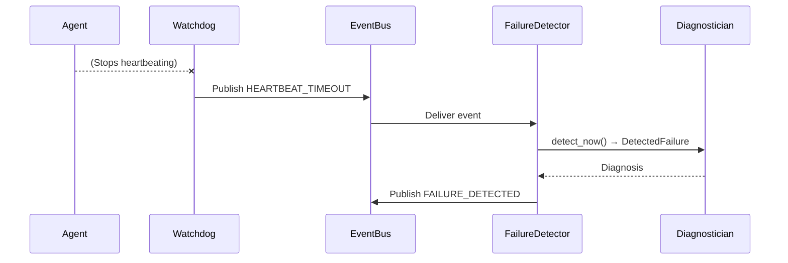
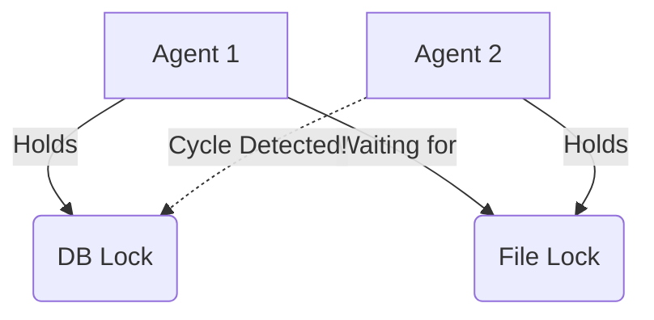
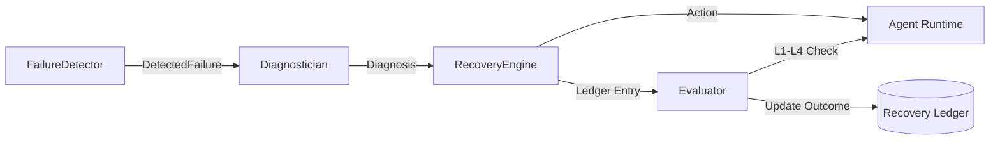
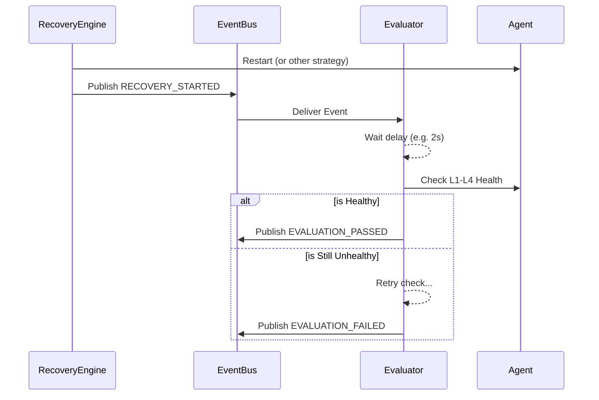
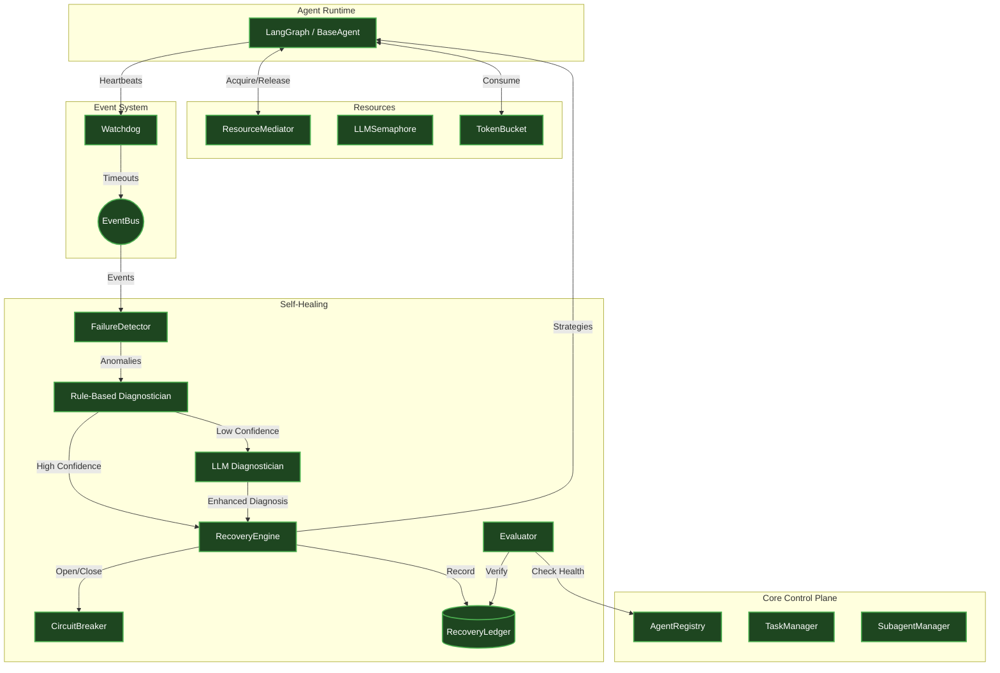

# BOSSman — Living Engineering Documentation

**Last verified phase:** Phase 7  
**Test status:** 189 passing  
**Implementation status:** Active Development (Phases 0–7 Complete)  
**Last verification:** 2026-10-02  

This is the AI Systems Engineering and Architecture handbook for BOSSman. It explains the entire system from first principles, documenting what actually exists in the repository.

---

## 1. BOSSman in One Minute

**What BOSSman is:**  
BOSSman (Backend Orchestrator & Self-healing Supervisor) is a control plane and operating system for intelligent AI agents. It sits above individual agent frameworks, treating them as fallible processes that need supervision, resource management, and automated recovery.

**What problem it solves:**  
In production, multi-agent systems fail unpredictably: they deadlock on shared resources, get trapped in retry storms against rate-limited APIs, exhaust their context windows, or silently degrade in quality. Standard frameworks don't natively solve orchestration-level resilience.

**Why it exists:**  
To prevent cascaded failures across an agent workforce and ensure deterministic, verifiable recovery without relying purely on LLM self-correction.

**BOSSman vs. LangGraph:**  
LangGraph manages the internal state machine (the *process*) of a single agent. BOSSman manages the *workforce* (the *operating system*). BOSSman does not care how the agent thinks; it cares whether the agent is healthy, making progress, and not hoarding resources.

### Simple Architecture



---

## 2. The Core Mental Model

BOSSman maps operating system concepts to AI agent supervision.

| OS Concept | BOSSman Concept | Implemented? |
| :--- | :--- | :--- |
| Process | Agent (LangGraph/BaseAgent) | ✅ Yes |
| Process scheduler | TaskManager | ✅ Yes |
| Process table | AgentRegistry | ✅ Yes |
| Watchdog | Watchdog (Stagnation detection) | ✅ Yes |
| Semaphore | LLMSemaphore (Concurrency cap) | ✅ Yes |
| Rate limiter | TokenBucket (Throughput cap) | ✅ Yes |
| Mutex / lock | ResourceMediator (Exclusive access)| ✅ Yes |
| Deadlock | Agent/resource deadlock detection | ✅ Yes |
| IPC | EventBus | ✅ Yes |
| Process failure | Agent failure (STUCK/FAILED) | ✅ Yes |
| Restart | Agent recovery (10 strategies) | ✅ Yes |
| Checkpoint | LangGraph state persistence | ⚠️ Partial (Rollback directive) |
| Memory pressure | Context pressure / Overflow | ✅ Yes |
| OOM-like protection | Context compaction directive | ✅ Yes |
| Kernel policy | SubagentManager (Duplicate block) | ✅ Yes |

---

## 3. Full Architecture



---

## 4. System Planes

### Control Plane
Manages workforce state.
- **AgentRegistry**: Source of truth for agent existence, status (IDLE, RUNNING, STUCK), and resource holdings.
- **TaskManager**: Distributes tasks, tracks retries, and maintains the Dead Letter Queue (DLQ).
- **SubagentManager**: Prevents duplicate spawns via idempotency keys.

### Observability Plane
Handles telemetry and system vitals.
- **EventBus**: The central nervous system. Asynchronous, typed pub/sub.
- **Watchdog**: Scans the AgentRegistry for stale heartbeats.

### Self-Healing Plane
Implements the Detect → Diagnose → Recover → Verify loop.
- **FailureDetector**: Uses sliding windows over EventBus streams to detect anomalies.
- **Diagnostician**: Maps failures to root causes and recovery strategies using rules.
- **LLMDiagnostician**: Augments rule-based diagnosis for novel failures.
- **RecoveryEngine**: Executes actions (restart, circuit break, escalate).
- **Evaluator**: Verifies recovery success via L1-L4 health checks.
- **RecoveryLedger**: Persists the audit trail.

### Policy / Trust Plane
- **PermissionTiers**: Enforced at the base agent level, restricting destructive operations based on role.

### State / World Model
- BOSSman knows what agents exist, what tasks they are running, what resources they hold, their token budget status, and their context window utilization.

---

## 5. Phase-by-Phase Status

| Phase | Purpose | Status | Important Components | Tests |
| --- | --- | --- | --- | --- |
| 0 | Agent Contract | ✅ Done | `AgentState`, `BossmanEvent` | Core models |
| 1 | BOSSman Core | ✅ Done | `EventBus`, `Registry`, `Watchdog`, `FaultInjector` | 44 |
| 2 | Real Agent | ✅ Done | `BaseAgent`, `ResearchAgent`, `SubagentManager` | 13 |
| 3 | Resource Mgr | ✅ Done | `LLMSemaphore`, `TokenBucket`, `ResourceMediator` | 22 |
| 4 | Detection | ✅ Done | `FailureDetector`, `Diagnostician` | 18 |
| 5 | Recovery | ✅ Done | `RecoveryEngine`, `CircuitBreaker` | 30 |
| 6 | Evaluator | ✅ Done | `Evaluator`, `HealthChecker` | 30 |
| 7 | LLM Diagnosis | ✅ Done | `LLMDiagnostician` | 33 |
| 8 | Dashboard | 🔜 Future | React Flow UI, WebSockets | 0 |

---

## 6. Repository Map

```text
bossman/
├── agents/                  # Phase 2: Agent runtime
│   ├── base_agent.py        # Abstract agent with built-in heartbeat & telemetry loop
│   └── research_agent.py    # Concrete implementation of LangGraph agent
├── context/                 # Documentation and theory (zylos.md, dev-phases.md)
├── contracts/               # Phase 0: System boundaries
│   ├── agent_state.py       # Dataclasses for Agent registry state
│   ├── events.py            # Event definitions and bus structures
│   └── recovery_ledger.py   # Schemas for failure incidents and recovery tracking
├── core/                    # Phase 1/2: Orchestration layer
│   ├── event_bus.py         # Async pub/sub broker
│   ├── fault_injector/      # Chaos engineering tools for testing resilience
│   ├── registry.py          # Central state table for agents
│   ├── subagent_manager.py  # Duplicate spawn protection
│   └── task_manager.py      # Lifecycle tracking and DLQ
├── detection/               # Phase 4/7: Anomaly detection and root cause mapping
│   ├── diagnostician.py     # Deterministic rule engine
│   ├── failure_detector.py  # Sliding window event aggregators
│   └── llm_diagnostician.py # Fallback LLM analysis for ambiguous faults
├── evaluation/              # Phase 6: Post-recovery verification
│   ├── evaluator.py         # Subscribes to RECOVERY_STARTED, waits, verifies
│   └── health_checker.py    # Pure L1-L4 state inspector
├── recovery/                # Phase 5: Action execution
│   ├── circuit_breaker.py   # Three-state fault isolation
│   └── recovery_engine.py   # Applies strategies + Erlang restart budgets
├── resources/               # Phase 3: Contention management
│   ├── llm_semaphore.py     # Concurrency limits
│   ├── mediator.py          # Exclusive locking and wait-for graphs
│   ├── resource_manager.py  # Unified facade
│   └── token_bucket.py      # Rate limit throughput management
└── tests/                   # Test suite (189 passing)
```

---

## 7. Agent Lifecycle

1. **Registration**: SubagentManager checks idempotency, registers in AgentRegistry.
2. **Execution**: Task assigned. Status → `RUNNING`.
3. **Telemetry**: Background task sends heartbeats every 5s, updating token/context usage.
4. **Completion**: Status → `IDLE` or `TERMINATED`.
5. **Failure**: Catch exceptions, Status → `FAILED`. Watchdog triggers if loop dies (`STUCK`).
6. **Recovery**: RecoveryEngine moves status `STUCK` → `RECOVERING` → `IDLE`.
7. **Verification**: Evaluator runs L1-L4 health checks.



---

## 8. Task Lifecycle



---

## 9. Event System

The `EventBus` is an async pub/sub broker.
- **Structure**: `BossmanEvent` (Type, AgentId, Payload, Timestamp).
- **Subscriptions**: Handlers can subscribe to specific `EventType` or use wildcards (`*`).
- **Isolation**: Each handler runs in its own asyncio task. One failing handler does not crash the bus.

**Failure Sequence:**


---

## 10. Heartbeat + Watchdog

**Mechanism**:
- Agents push `Heartbeat` objects periodically (default 5s).
- Heartbeats contain telemetry: context utilization, token fraction, current step.
- `Watchdog` wakes up (e.g., every 10s), scans `AgentRegistry`, finds agents where `now() - last_heartbeat > timeout`.
- Sets agent status to `STUCK`, emits `HEARTBEAT_TIMEOUT` event.

**Directives**:
- Heartbeat ACKs can carry directives back to the agent (e.g., `compact_context`, `rollback_checkpoint`).

---

## 11. Resource Management

**LLM Semaphore**:
- Controls concurrency. E.g., max 20 parallel calls to Anthropic.
- Agents waiting for the semaphore do not cause deadlocks unless they hold other exclusive locks.

**Token Bucket**:
- Controls throughput. E.g., 40,000 tokens/min.
- Refills based on time. Agents `consume()` and await replenishment if burst capacity is exceeded.

**Resource Mediator**:
- Grants exclusive locks (`acquire()`, `release()`).
- Tracks who holds what (`resources_held`) and who wants what (`resources_waiting`).
- **Deadlock Detection**: Runs cycle detection on the wait-for graph. If a circular wait is detected, the requesting agent's acquire fails immediately.
- **Deadlock Prevention**: Implemented via strict timeouts on `acquire()`.



---

## 12. Idempotency

**Problem**: Network retries or confused planners often spawn the same subagent twice, corrupting data and wasting resources.
**Solution**: `SubagentManager.spawn()` requires an `idempotency_key`.
- If key exists in cache, returns the existing agent ID.
- Emits `DUPLICATE_SPAWN_BLOCKED`.
- Prevents LLM hallucinations from fork-bombing the system.

---

## 13. Context Management

Context is treated as a finite resource like RAM.
- **Monitoring**: Telemetry reports `context_utilisation`.
- **Thresholds**: Evaluator L3 warns at 75%, fails at 95%.
- **OOM Protection**: RecoveryEngine issues `CONTEXT_COMPACTION` directive via heartbeat. The agent must summarize its message history before continuing.

---

## 14. Permission / Trust Model

`PermissionTier` restricts tool execution at the infrastructure level.
- **Tiers**: `READ_ONLY`, `READ_WRITE`, `ADMIN`, `REQUIRES_APPROVAL`.
- **Enforcement**: Handled in `BaseAgent._execute_tool`.
- **Why**: Prompt engineering is not a security boundary. Infrastructure enforcement guarantees agents cannot bypass restrictions via prompt injection.

---

## 15. Fault Injection / Chaos Engineering

Allows deterministic testing of self-healing behavior without waiting for real network failures.

| Fault | How injected | Expected signal | Expected diagnosis |
| --- | --- | --- | --- |
| Context Overflow | Overrides context_utilisation to 0.98 | EventBus anomaly | CONTEXT_OVERFLOW |
| Infinite Loop | Suspends the heartbeat background task | Watchdog timeout | HEARTBEAT_TIMEOUT |
| Retry Storm | Emits 10 TASK_FAILED events rapidly | Sliding window max | RETRY_STORM |

---

## 16. Failure Detection

`FailureDetector` uses sliding windows to detect patterns in the event stream.

- **RETRY_STORM**: N `TASK_FAILED` events in window `T`.
- **CASCADING_FAILURE**: >N unique agents failing in window `T`.
- **Proactive Detection**: `detect_now(state)` scans state snapshots for context limits and deadlocks (holds + waits).

---

## 17. Rule-Based Diagnostician

Produces `Diagnosis` objects deterministically.
- Rule match generates high confidence (0.8 - 0.95).
- Output: `FailureType`, `RecoveryStrategy`, `confidence`, `needs_llm_review=False`.
- **Why First?**: Deterministic, fast, and free. Covers 90% of known failures without calling an LLM.

---

## 18. Recovery Architecture

`RecoveryEngine` implements 10 strategies:

1. **WAIT_AND_RETRY**: Exponential backoff.
2. **RESTART_AGENT**: Clears resource state, resets status to IDLE.
3. **REASSIGN_TASK**: Finds a healthy agent of the same role.
4. **ROLLBACK_CHECKPOINT**: Signals agent to restore previous LangGraph state.
5. **CIRCUIT_BREAKER**: Opens `CircuitBreaker` (fast-fail for external APIs).
6. **FALLBACK_MODEL**: Signals agent to degrade LLM quality.
7. **CONTEXT_COMPACTION**: Signals agent to summarize memory.
8. **RELEASE_RESOURCES**: Force-clears locks in Registry.
9. **QUEUE_FOR_LATER**: Moves task to DLQ.
10. **ESCALATE_HUMAN**: Terminal action. Emits `HUMAN_GATE_REQUIRED`.

**Restart Budget**: Erlang-style supervisor pattern. Max 3 restarts per 60s window. Exhaustion forces `ESCALATE_HUMAN`.

---

## 19. Recovery Ledger

Append-only audit log in memory (planned for Postgres).
Tracks: Failure → Strategy Chosen → Outcome → Evaluator Verification.
Vital for dashboard timelines and LLM Diagnostician context.

---

## 20. L1–L4 Health Model

Implemented in `HealthChecker`.
- **L1 Liveness**: Status is healthy, heartbeats are fresh.
- **L2 Progress**: Low consecutive failures, high completion rate.
- **L3 Resources**: No deadlock suspect, context < 75%, tokens < 85%.
- **L4 Quality**: No `quality_degraded` flags in agent metadata.

---

## 21. Data Flow

### Recovery Pipeline


---

## 22. Sequence Diagrams

### Recovery Verification Loop


---

## 23. Failure Taxonomy

| Failure | Detection | Diagnosis | Recovery | Verification |
| --- | --- | --- | --- | --- |
| Heartbeat Timeout | ✅ Implemented | ✅ Implemented | ✅ Implemented | ✅ Implemented |
| Retry Storm | ✅ Implemented | ✅ Implemented | ✅ Implemented | ✅ Implemented |
| Deadlock | ✅ Implemented | ✅ Implemented | ✅ Implemented | ✅ Implemented |
| Context Overflow | ✅ Implemented | ✅ Implemented | ✅ Implemented | ✅ Implemented |
| Resource Starvation| ✅ Implemented | ✅ Implemented | ✅ Implemented | ✅ Implemented |
| Cascading Failure | ✅ Implemented | ✅ Implemented | ✅ Implemented | ✅ Implemented |
| Silent Degradation | ✅ Implemented | ✅ Implemented | ✅ Implemented | ✅ Implemented |

---

## 24. Testing Architecture

- **Phase 1-7 Tests**: 189 tests covering unit logic and cross-component integration.
- **Fault Injection Tests**: Deterministic assertions that anomalous states trigger the correct EventBus patterns.
- **Integration Layer**: E.g., `test_phase6_evaluator.py` tests the actual flow from `EventBus` → `Evaluator` → `Registry`.

---

## 25. Current System Capabilities

### BOSSman CAN currently:
- Register agents and track their heartbeat telemetry.
- Prevent duplicate agent spawns via idempotency keys.
- Manage exclusive resources, concurrency caps, and rate limits.
- Detect deadlocks via cycle detection in wait-for graphs.
- Detect retry storms and context overflows via sliding windows.
- Map failures to 10 distinct recovery strategies.
- Enforce restart budgets (max restarts per window).
- Open circuit breakers to protect external APIs.
- Evaluate recovery success using L1-L4 health checks.
- Fall back to an LLM for novel failure diagnosis.

### BOSSman CANNOT currently:
- Run across distributed network nodes (it is currently a single-process asyncio architecture).
- Persist the RecoveryLedger to PostgreSQL (in-memory only).
- Serve the visual React Flow dashboard (Phase 8).
- Persist LangGraph checkpoints outside of SQLite.

---

## 26. Known Limitations

1. **Single-Process Asyncio**: While robust, the current EventBus and Registry are memory-bound. Scaling to multi-node requires swapping the EventBus for Redis/RabbitMQ.
2. **In-Memory Ledger**: `RecoveryLedger` data is lost on process restart.

---

## 27. Why Each Technology Exists

- **Python & asyncio**: Required for high-concurrency event loops and compatibility with AI libraries.
- **LangGraph**: Used inside `ResearchAgent` to manage the actual cognitive loop (graphs, nodes, edges). BOSSman wraps it.
- **Pydantic**: Enforces strict typing for the `EventBus` and `AgentState`.
- **Pytest**: Validates deterministic recovery behavior using `FaultInjector`.

---

## 28. OpenAI / Anthropic Integration

**WHERE it fits and WHY:**
The LLM is NOT responsible for runtime control. It sits in `LLMDiagnostician` (Phase 7).
Flow: Deterministic failure → Low confidence from rules → Gather structured JSON telemetry → Ask LLM → Parse JSON strategy → Execute deterministically.

---

## 29. Architecture Decisions

- **Why EventBus?** Tight coupling between a Watchdog and a RecoveryEngine causes spaghetti code. Pub/sub isolates detection from recovery.
- **Why deterministic rules before LLM?** Cost, speed, and reliability. 90% of system failures (timeouts, out-of-memory) are well understood. LLMs are reserved for the 10% edge cases (novel tool hallucinations).
- **Why context compaction?** Context isn't infinite. Treating it as a system resource (like RAM) allows BOSSman to trigger "Garbage Collection" (compaction) before an API hard-fails.
- **Why recovery verification?** Without it, an orchestrator can restart a deadlocked agent forever. Verification closes the loop.

---

## 30. "Explain BOSSman Like I Have to Defend It"

**What is BOSSman?**  
It's an orchestrator and control plane for AI agents.

**Why isn't this just LangGraph?**  
LangGraph manages *one* agent's thoughts. BOSSman manages *fleet* health. LangGraph doesn't know if two distinct agents are deadlocked over a database lock.

**How do you prevent deadlocks?**  
`ResourceMediator` tracks a wait-for graph. When Agent A requests a lock held by Agent B, we check for cycles. If found, we reject the request immediately.

**How do you know recovery succeeded?**  
The `Evaluator` waits after a recovery action, then polls `HealthChecker` (L1-L4 checks). If it fails, the ledger updates to FAILURE and we can escalate.

---

## 31. Learning Path

### What I Should Understand Before Moving to the Next Phase

**Phase 8 (Dashboard):**
- WebSockets for streaming EventBus activity to a frontend.
- React Flow for rendering agent graphs.
- Translation of `AgentState` dictionaries into frontend node representations.
- Visualizing `RecoveryLedger` items on a timeline.

---

## 32. Current Architecture Diagram


